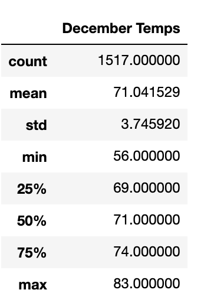

# Surfs_Up

## Overview

This analysis is to determine whether an ice cream shop in Oahu is a viable, year-round business. To do this we will examine the temperatures in the hottest and coldest months of the year (June and December) to see how large of a temperature variation there is throughout the year.

## Results

- Average temperature is about 3 degrees cooler in December than in June
- The minimum temperature is a decent bit lower in December (about 8 degrees)
- Temperatures seem to fluctuate a bit more in December with a slightly higher standard deviation

     

## Summary

Overall, the temperature doesn't seem to change all that much in Oahu. For this reason it seems to be a pretty great place for any kind of hot weather treat. However, it would be helpful to know the percipitation levels during those time frames as well as that could effect how often people go out. Finally, if we were really to drill down on this idea, we could query the individual stations for these data points to find the most agreeable weather conditions and figure out exactly where we want to locate this ice cream shop.
